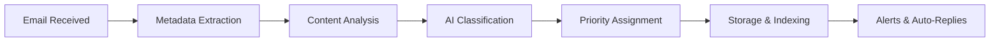

# HubMail - User Guide

## 📚 Table of Contents

1. [Getting Started](#getting-started)
2. [Dashboard Overview](#dashboard-overview)
3. [Email Processing](#email-processing)
4. [Using Services](#using-services)
5. [Searching & Analytics](#searching--analytics)
6. [Workflow Management](#workflow-management)
7. [Monitoring & Alerts](#monitoring--alerts)
8. [Troubleshooting](#troubleshooting)

---

## 🚀 Getting Started

### System Requirements
- **Web Browser**: Chrome, Firefox, Safari, Edge (latest versions)
- **Network Access**: All services run on localhost with custom ports
- **Permissions**: No special permissions required for viewing

### Accessing the System

1. **Open Dashboard**: Navigate to `http://localhost:1880` (or your configured port)
2. **Check System Status**: Green indicators show services are online
3. **Explore Services**: Click on service cards to access different tools

### First Time Setup

```bash
# 1. Generate dashboard
python docs/generate-dashboard.py

# 2. Open dashboard
open web/index.html

# 3. Check all services are running
curl http://localhost:1880  # Node-RED
curl http://localhost:11435 # Ollama
curl http://localhost:9090  # Prometheus
curl http://localhost:3000  # Grafana
```

---

## 🎛️ Dashboard Overview

### Main Dashboard Components

#### 📊 **Statistics Panel**
- **Emails Processed**: Total number of emails analyzed
- **Classification Accuracy**: Percentage of correctly classified emails
- **Active Alerts**: Current issues requiring attention
- **Average Processing Time**: Time per email in milliseconds

#### 🖥️ **Service Status**
Real-time status monitoring for all components:
- 🟢 **Online**: Service is running and accessible
- 🔴 **Offline**: Service is down or unreachable
- 🟡 **Checking**: Status being verified

#### ⚡ **Quick Actions**
- **Process Email**: Manually submit an email for processing
- **Recent Emails**: View latest processed emails
- **View Alerts**: Check high-priority emails
- **System Info**: Display configuration details

---

## 📧 Email Processing

### Supported Email Sources

Based on your configuration:
```
IMAP, POP3, SMTP, Microsoft Graph API, Gmail API
```

### Processing Methods

#### Method 1: Automatic Email Checking
```bash
# System automatically checks for new emails based on your configuration
# Check interval is set in .env file: EMAIL_CHECK_INTERVAL=300 (in seconds)

# Manually trigger email check
curl -X POST "http://localhost:1880/api/email/check"
```

#### Method 2: Manual Email Submission
1. Open Node-RED: `http://localhost:1880`
2. Navigate to email submission flow
3. Use web form to submit email details

#### Method 3: API Submission
```bash
# Submit email via API
curl -X POST "http://localhost:1880/api/email/process" \
  -H "Content-Type: application/json" \
  -d '{
    "from": "sender@example.com",
    "to": "recipient@example.com",
    "subject": "Meeting Request",
    "body": "Can we schedule a meeting for tomorrow?",
    "date": "2024-01-20T10:30:00Z"
  }'
```

### Processing Workflow



### Email Classifications & Processing

#### 🔴 **URGENT**
- **Criteria**: Time-sensitive, critical business impact
- **Actions**: Immediate notifications, high-priority tagging
- **Auto-Reply**: Acknowledgment of urgent status with ETA

#### 🔵 **BUSINESS**
- **Criteria**: Work-related, standard business communications
- **Actions**: Categorization by department/topic
- **Auto-Reply**: Standard business acknowledgment

#### 🟢 **PERSONAL**
- **Criteria**: Non-business, personal communications
- **Actions**: Lower priority tagging, separate folder
- **Auto-Reply**: Optional personal acknowledgment

#### ⚪ **SPAM**
- **Criteria**: Unsolicited, suspicious, or marketing emails
- **Actions**: Quarantine, spam folder placement
- **Auto-Reply**: None (to avoid confirming valid email)

---

## 🛠️ Using Services

### Node-RED (Port: 1880)

**Purpose**: Visual workflow designer for email processing

**Key Features**:
- Drag-and-drop flow creation
- Real-time email processing
- Custom business logic
- Integration with external systems

**Common Tasks**:
```javascript
// Example: Custom email classifier
if (msg.payload.subject.includes('urgent')) {
    msg.classification = 'URGENT';
    return [msg, null, null, null];
} else if (msg.payload.from.includes('boss')) {
    msg.classification = 'BUSINESS';
    return [null, msg, null, null];
} else if (msg.payload.subject.includes('personal')) {
    msg.classification = 'PERSONAL';
    return [null, null, msg, null];
} else {
    msg.classification = 'SPAM';
    return [null, null, null, msg];
}
```

### Grafana Analytics (Port: 3000)

**Purpose**: Visualize email processing metrics and trends

**Key Dashboards**:
- **Email Overview**: Processing statistics and trends
- **Classification Accuracy**: AI model performance
- **System Performance**: Processing efficiency analysis

**Dashboard Examples**:
- Email volume by hour/day/week
- Classification distribution pie chart
- Processing time histogram
- Auto-reply effectiveness

### Prometheus (Port: 9090)

**Purpose**: Time-series metrics collection

**Key Metrics**:
- `email_processed_total`: Total emails processed
- `email_processing_duration_seconds`: Processing time
- `email_classification_count{type="URGENT"}`: Count by type
- `email_auto_reply_sent_total`: Auto-replies sent

**Query Examples**:
```promql
# Average processing time over last hour
rate(email_processing_duration_seconds_sum[1h]) / rate(email_processing_duration_seconds_count[1h])

# Email classification distribution
email_classification_count{type="URGENT"} / sum(email_classification_count)

# System load during email processing
node_cpu_seconds_total{mode="system"} / node_cpu_seconds_total{mode="idle"}
```

### Ollama (Port: 11435)

**Purpose**: AI model for email classification and analysis

**Key Features**:
- Local LLM model execution
- Email content analysis
- Intent classification
- Entity extraction

**API Examples**:
```bash
# Generate email classification
curl -X POST "http://localhost:11435/api/generate" \
  -H "Content-Type: application/json" \
  -d '{
    "model": "llama2:7b",
    "prompt": "Classify this email: Subject: Urgent Meeting, From: boss@company.com, Body: We need to discuss the project status immediately.",
    "stream": false
  }'
```

---

## 🔍 Searching & Analytics

### Email Search

**Search Interface**: Node-RED Dashboard or API

**Search Parameters**:
- `from`: Sender email address
- `to`: Recipient email address
- `subject`: Email subject line
- `body`: Email body content
- `date`: Date range
- `classification`: Email classification
- `has_attachments`: Boolean filter

**Search Examples**:
```bash
# Find urgent emails from last week
curl "http://localhost:1880/api/email/search?classification=URGENT&from=2024-01-01"

# Search for specific content
curl "http://localhost:1880/api/email/search?q=project+status"

# Advanced search with JSON
curl -X POST "http://localhost:1880/api/email/search" \
  -H "Content-Type: application/json" \
  -d '{
    "query": {
      "bool": {
        "must": [
          {"match": {"subject": "meeting"}},
          {"range": {"date": {"gte": "now-7d"}}}
        ]
      }
    }
  }'
```

### Analytics Reports

**Standard Reports**:
- **Daily Summary**: Email volume and classification breakdown
- **Processing Efficiency**: Average processing times
- **Classification Accuracy**: AI model performance
- **Auto-Reply Effectiveness**: Response rates and timing

**Custom Reports**:
1. Open Grafana: `http://localhost:3000`
2. Navigate to Dashboards
3. Use Dashboard variables to filter by date, classification, etc.
4. Export as PDF or CSV

---

## 🔄 Workflow Management

### Creating Custom Workflows

**Using Node-RED**:
1. Open Node-RED: `http://localhost:1880`
2. Import or create new flow
3. Add email processing nodes
4. Configure classification logic
5. Set up actions and notifications
6. Deploy changes

**Example Workflow: VIP Sender**:
```
[Email In] → [Filter VIP] → [Set Priority] → [Notify Slack] → [Auto-Reply] → [Store]
```

### Auto-Reply Templates

**Template Variables**:
- `{{sender}}`: Email sender name
- `{{recipient}}`: Email recipient
- `{{subject}}`: Original subject
- `{{date}}`: Email received date
- `{{classification}}`: Email classification

**Example Template**:
```html
<p>Dear {{sender}},</p>

<p>Thank you for your email regarding "{{subject}}".</p>

<p>This is an automated response confirming we've received your message
and it has been classified as {{classification}}.</p>

<p>We'll respond within:
{{#if classification == 'URGENT'}}
  2 hours
{{else if classification == 'BUSINESS'}}
  24 hours
{{else}}
  48 hours
{{/if}}
</p>

<p>Best regards,<br>
HubMail System</p>
```

### Notification Channels

**Available Channels**:
- **Slack**: Real-time notifications
- **Email**: Summary reports
- **SMS**: Urgent alerts (requires configuration)
- **Webhook**: Custom integrations

**Slack Configuration**:
```bash
# In .env file
WEBHOOK_URL=https://hooks.slack.com/services/your-webhook-url
WEBHOOK_ENABLED=true
WEBHOOK_CHANNEL=#email-alerts
```

---

## 📊 Monitoring & Alerts

### System Monitoring

**Key Metrics**:
- **Email Volume**: Emails processed per minute/hour/day
- **Processing Time**: Average and 95th percentile
- **Classification Distribution**: Percentage by category
- **Error Rate**: Failed processing attempts
- **System Resources**: CPU, memory, disk usage

**Viewing Metrics**:
1. Open Grafana: `http://localhost:3000`
2. Navigate to "System Overview" dashboard
3. Adjust time range as needed

### Alert Configuration

**Alert Types**:
- **System Alerts**: Service down, high resource usage
- **Processing Alerts**: High error rate, slow processing
- **Email Alerts**: Urgent emails, specific senders/keywords

**Setting Up Alerts**:
1. Open Grafana: `http://localhost:3000`
2. Navigate to Alerting
3. Create new alert rule
4. Configure conditions and notifications

**Example Alert Rule**:
```yaml
# Alert when URGENT emails are not processed within 5 minutes
name: UrgentEmailDelayed
expr: time() - max(email_received_timestamp{classification="URGENT"}) > 300
for: 5m
labels:
  severity: critical
annotations:
  summary: Urgent email processing delayed
  description: Urgent emails have not been processed in over 5 minutes
```

---

## 🆘 Troubleshooting

### Common Issues

#### Email Connection Problems
```bash
# Check email server connectivity
nc -zv $EMAIL_SERVER $EMAIL_PORT

# View detailed connection logs
docker-compose logs node-red | grep "Email connection"

# Test email credentials
curl -X POST "http://localhost:1880/api/email/test-connection"
```

#### Classification Issues
```bash
# Check AI model status
curl "http://localhost:11435/api/tags"

# View classification logs
docker-compose logs node-red | grep "Classification"

# Manually classify an email to test
curl -X POST "http://localhost:1880/api/email/classify" \
  -H "Content-Type: application/json" \
  -d '{
    "subject": "Test Subject",
    "body": "Test Body"
  }'
```

#### Performance Problems
```bash
# Check system resources
docker stats

# View processing times
curl "http://localhost:1880/api/email/stats"

# Restart services if needed
docker-compose restart node-red ollama
```

### Logs & Diagnostics

**Viewing Logs**:
```bash
# All services
docker-compose logs

# Specific service
docker-compose logs node-red

# Follow logs in real-time
docker-compose logs -f

# Filter logs
docker-compose logs | grep "error"
```

**Diagnostic Tools**:
1. **Health Check**: `curl http://localhost:1880/api/system/status`
2. **Email Queue**: `curl http://localhost:1880/api/email/queue`
3. **Service Metrics**: `curl http://localhost:9090/api/v1/query?query=up`

### Getting Help

If you encounter issues not covered here:

1. **Check Documentation**: Review CONFIG.md and INSTALL.md
2. **System Logs**: Examine detailed logs for errors
3. **Support Channels**: Contact your system administrator

---

## 🔒 Security & Privacy

### Email Security

**Best Practices**:
- Use OAuth2 for email authentication when possible
- Enable TLS/SSL for email connections
- Regularly rotate email credentials
- Limit access to sensitive emails

**Configuration**:
```bash
# In .env file
EMAIL_SECURE=true
EMAIL_AUTH_TYPE=oauth2
EMAIL_OAUTH_CLIENT_ID=your-client-id
EMAIL_OAUTH_CLIENT_SECRET=your-client-secret
```

### Data Retention

**Default Policy**:
- Processed emails stored for 90 days
- Attachments stored for 30 days
- Logs retained for 14 days

**Custom Configuration**:
```bash
# In .env file
EMAIL_RETENTION_DAYS=90
ATTACHMENT_RETENTION_DAYS=30
LOG_RETENTION_DAYS=14
```

---

## 📱 Mobile Access

### Mobile Dashboard

The HubMail dashboard is responsive and can be accessed from mobile devices:

1. Open your mobile browser
2. Navigate to your server address and port
3. Login with your credentials

**Mobile Features**:
- View email statistics
- Receive notifications
- Check system status
- Process urgent emails

---

## 🔄 Updates & Maintenance

### Updating HubMail

```bash
# Pull latest changes
git pull

# Update containers
docker-compose pull

# Restart services
docker-compose down
docker-compose up -d
```

### Backup & Restore

**Backup Data**:
```bash
# Backup configuration
cp .env .env.backup

# Backup Node-RED flows
curl "http://localhost:1880/flows" > flows-backup.json

# Backup Redis data
docker-compose exec redis redis-cli SAVE
```

**Restore Data**:
```bash
# Restore configuration
cp .env.backup .env

# Restore Node-RED flows
curl -X POST "http://localhost:1880/flows" \
  -H "Content-Type: application/json" \
  -d @flows-backup.json

# Restart system
docker-compose restart
```

---

**🎉 You're now ready to use HubMail for efficient email processing!**