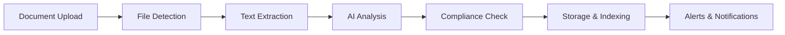

# DocPro - User Guide

## 📚 Table of Contents

1. [Getting Started](#getting-started)
2. [Dashboard Overview](#dashboard-overview)
3. [Document Upload & Processing](#document-upload--processing)
4. [Using Services](#using-services)
5. [Searching & Analytics](#searching--analytics)
6. [Workflow Management](#workflow-management)
7. [Monitoring & Alerts](#monitoring--alerts)
8. [Troubleshooting](#troubleshooting)

---

## 🚀 Getting Started

### System Requirements
- **Web Browser**: Chrome, Firefox, Safari, Edge (latest versions)
- **Network Access**: All services run on localhost with custom ports
- **Permissions**: No special permissions required for viewing

### Accessing the System

1. **Open Dashboard**: Navigate to `http://localhost:1880` (or your configured port)
2. **Check System Status**: Green indicators show services are online
3. **Explore Services**: Click on service cards to access different tools

### First Time Setup

```bash
# 1. Generate dashboard
python docs/generate-dashboard.py

# 2. Open dashboard
open web/index.html

# 3. Check all services are running
curl http://localhost:9200  # Elasticsearch
curl http://localhost:5601  # Kibana  
curl http://localhost:1880  # Node-RED
```

---

## 🎛️ Dashboard Overview

### Main Dashboard Components

#### 📊 **Statistics Panel**
- **Documents Processed**: Total number of documents analyzed
- **Compliance Rate**: Percentage of documents meeting standards
- **Active Alerts**: Current issues requiring attention
- **Average Processing Time**: Time per document in seconds

#### 🖥️ **Service Status**
Real-time status monitoring for all components:
- 🟢 **Online**: Service is running and accessible
- 🔴 **Offline**: Service is down or unreachable
- 🟡 **Checking**: Status being verified

#### ⚡ **Quick Actions**
- **Upload Document**: Start document processing
- **Recent Documents**: View latest processed files
- **View Alerts**: Check compliance issues
- **System Info**: Display configuration details

---

## 📄 Document Upload & Processing

### Supported File Types

Based on your configuration:
```
PDF, DOCX, DOC, TXT, PNG, JPG, JPEG, TIFF, RTF, ODT
```

### Upload Methods

#### Method 1: File System (Recommended)
```bash
# Copy files to input directory
cp your-document.pdf data/input/

# Files are automatically processed
ls data/processed/  # Check results
```

#### Method 2: MinIO Console
1. Open MinIO Console: `http://localhost:9001`
2. Login: `minioadmin` / `minioadmin123`
3. Navigate to `documents` bucket
4. Upload files via web interface

#### Method 3: Node-RED Interface
1. Open Node-RED: `http://localhost:1880`
2. Navigate to file upload flow
3. Use web form to upload documents

### Processing Workflow



### Document Types & Analysis

#### 📋 **Certificates of Conformity (COR)**
- **Validation**: Certificate number, validity dates
- **Compliance**: Standards verification (EN ISO, PED, etc.)
- **Alerts**: Expiring certificates, missing signatures

#### 💰 **Invoices**
- **Data Extraction**: Amount, date, supplier, line items
- **Validation**: Math verification, format checks
- **Approval**: High-value invoice routing (>€10,000)

#### 📝 **Contracts**
- **Risk Assessment**: Financial, legal, operational risks
- **Key Terms**: Payment terms, liability, termination
- **Alerts**: High-risk clauses, unfavorable terms

---

## 🛠️ Using Services

### Node-RED (Port: 1880)

**Purpose**: Visual workflow designer for document processing

**Key Features**:
- Drag-and-drop flow creation
- Real-time document processing
- Custom business logic
- Integration with external systems

**Common Tasks**:
```javascript
// Example: Custom document classifier
if (msg.filename.includes('invoice')) {
    msg.documentType = 'INVOICE';
    return [msg, null, null];
} else if (msg.filename.includes('contract')) {
    msg.documentType = 'CONTRACT';
    return [null, msg, null];
} else {
    msg.documentType = 'OTHER';
    return [null, null, msg];
}
```

### Kibana Analytics (Port: 5601)

**Purpose**: Search, analyze, and visualize document data

**Key Dashboards**:
- **Document Overview**: Processing statistics and trends
- **Compliance Monitoring**: Alerts and issues tracking
- **Performance Metrics**: System efficiency analysis

**Search Examples**:
```kql
# Find high-value invoices
analysis_results.total_amount > 10000

# Search for compliance issues
analysis_results.compliance_status: "NON_COMPLIANT"

# Recent documents by type
document_type: "CONTRACT" AND processing_timestamp > "now-7d"
```

### MinIO Storage (Port: 9001)

**Purpose**: Object storage for documents and processed files

**Bucket Structure**:
- `documents`: Original uploaded files
- `processed`: AI-analyzed documents
- `templates`: Document processing templates

**Management Tasks**:
- Browse stored documents
- Download processed results
- Set retention policies
- Monitor storage usage

### Elasticsearch (Port: 9200)

**Purpose**: Search engine and document indexing

**API Examples**:
```bash
# Search documents
curl "http://localhost:9200/documents/_search?q=invoice"

# Get document by ID
curl "http://localhost:9200/documents/_doc/ABC123"

# Check indices
curl "http://localhost:9200/_cat/indices?v"
```

### Apache Tika (Port: 9998)

**Purpose**: Document text extraction and parsing

**Testing**:
```bash
# Extract text from document
curl -T document.pdf http://localhost:9998/tika

# Get metadata
curl -T document.pdf http://localhost:9998/meta

# Detect document type
curl -T document.pdf http://localhost:9998/detect
```

### Ollama AI (Port: 11437)

**Purpose**: Local AI models for document analysis

**Available Models**:
- `llama2:13b`: General document analysis
- `mistral:7b`: Faster processing for simple tasks

**API Usage**:
```bash
# List available models
curl http://localhost:11437/api/tags

# Generate analysis
curl -X POST http://localhost:11437/api/generate \
  -d '{"model": "llama2:13b", "prompt": "Analyze this invoice: ..."}'
```

---

## 🔍 Searching & Analytics

### Kibana Discovery

1. **Open Kibana**: `http://localhost:5601`
2. **Navigate to Discover**
3. **Select Index Pattern**: `documents*` or `compliance-alerts*`

### Common Search Patterns

#### Find Documents by Type
```kql
document_type: "INVOICE"
document_type: "CONTRACT" 
document_type: "COR"
```

#### Search by Date Range
```kql
processing_timestamp: [2024-01-01 TO 2024-12-31]
@timestamp: [now-7d TO now]
```

#### Filter by Analysis Results
```kql
analysis_results.confidence_score: [0.8 TO 1.0]
analysis_results.risk_level: "HIGH"
analysis_results.compliance_status: "COMPLIANT"
```

#### Text Search in Content
```kql
extracted_text: "certificate of conformity"
extracted_text: "invoice" AND extracted_text: "€"
```

### Creating Visualizations

#### Document Processing Trends
```json
{
  "visualization": "line_chart",
  "x_axis": "processing_timestamp",
  "y_axis": "count",
  "split_series": "document_type"
}
```

#### Compliance Rate by Document Type
```json
{
  "visualization": "pie_chart",
  "field": "analysis_results.compliance_status",
  "filter": "document_type: COR"
}
```

---

## ⚙️ Workflow Management

### Node-RED Flow Examples

#### Basic Document Processing Flow
1. **File Watcher** → Monitor `data/input/`
2. **Type Classifier** → Determine document type
3. **Tika Extractor** → Extract text content
4. **AI Analyzer** → LLM analysis
5. **Storage** → Save to Elasticsearch

#### Compliance Alert Flow
1. **Elasticsearch Query** → Find non-compliant docs
2. **Filter** → Check severity level
3. **Notification** → Send alerts (email/Slack)
4. **Dashboard Update** → Refresh statistics

#### Custom Business Logic
```javascript
// Example: Custom invoice approval logic
if (msg.analysis.total_amount > 50000) {
    msg.approval_required = "director";
    msg.priority = "high";
} else if (msg.analysis.total_amount > 10000) {
    msg.approval_required = "manager"; 
    msg.priority = "medium";
} else {
    msg.approval_required = "auto";
    msg.priority = "low";
}
```

### Creating Custom Workflows

1. **Open Node-RED**: `http://localhost:1880`
2. **Create New Flow**: Click "+" tab
3. **Drag Components**: From left palette
4. **Configure Nodes**: Double-click to edit
5. **Connect Flows**: Drag between output/input ports
6. **Deploy**: Click "Deploy" button

---

## 🔔 Monitoring & Alerts

### Alert Types

#### 🚨 **High Priority**
- **Compliance Issues**: Non-compliant COR certificates
- **Security Risks**: High-risk contract terms
- **System Errors**: Processing failures

#### ⚠️ **Medium Priority**
- **High-Value Invoices**: Amounts over threshold
- **Expiring Certificates**: Within 30 days
- **Processing Delays**: Longer than expected

#### ℹ️ **Low Priority**
- **Information Notices**: New document types
- **System Updates**: Configuration changes
- **Statistics**: Daily processing summaries

### Alert Channels

#### Kibana Dashboards
- Real-time alert visualization
- Historical trend analysis
- Custom alert queries

#### System Notifications
- Browser notifications
- Dashboard status badges
- Email alerts (if configured)

#### External Integrations
```bash
# Slack webhook (if configured)
SLACK_WEBHOOK_URL=https://hooks.slack.com/services/YOUR/SLACK/WEBHOOK

# Email SMTP (if configured)  
EMAIL_SMTP_HOST=smtp.company.com
EMAIL_FROM=docpro@company.com
```

### Alert Management

#### View Active Alerts
1. Open dashboard quick action "View Alerts"
2. Filter by severity: `severity: "HIGH"`
3. Sort by timestamp: newest first

#### Resolve Alerts
1. Investigate root cause in Kibana
2. Take corrective action
3. Update alert status if using custom workflow

---

## 🆘 Troubleshooting

### Common Issues

#### Service Not Responding
```bash
# Check service status
docker-compose ps

# View logs
docker-compose logs -f [service-name]

# Restart service
docker-compose restart [service-name]
```

#### Document Not Processing
1. **Check Input Folder**: Files present in `data/input/`?
2. **File Format**: Supported format? Check configuration
3. **File Size**: Under max limit? (Default: 50MB)
4. **Node-RED Flow**: Deployed and active?

#### Search Not Working
1. **Elasticsearch Status**: Green status in dashboard?
2. **Index Exists**: Check `http://localhost:9200/_cat/indices`
3. **Data Present**: Query document count
4. **Kibana Index Pattern**: Configured correctly?

#### AI Analysis Failing
```bash
# Check Ollama status
curl http://localhost:11437/api/tags

# Verify model available
docker-compose exec ollama ollama list

# Check model size vs available memory
docker stats
```

### Error Codes

| Code | Description | Solution |
|------|-------------|----------|
| `TIKA_TIMEOUT` | Document parsing timeout | Reduce file size or increase timeout |
| `LLM_UNAVAILABLE` | AI service not responding | Check Ollama service status |
| `INDEX_FULL` | Elasticsearch storage full | Clean old indices or add storage |
| `AUTH_FAILED` | MinIO access denied | Check credentials in .env |

### Log Analysis

#### Node-RED Logs
```bash
# View processing logs
docker-compose logs node-red | grep "Processing document"

# Error logs
docker-compose logs node-red | grep "ERROR"
```

#### Elasticsearch Logs
```bash
# Index operations
docker-compose logs elasticsearch | grep "index"

# Memory issues
docker-compose logs elasticsearch | grep "OutOfMemory"
```

### Performance Optimization

#### Memory Usage
```bash
# Monitor container memory
docker stats --format "table {{.Container}}\t{{.CPUPerc}}\t{{.MemUsage}}"

# Adjust Java heap (in .env)
ES_JAVA_OPTS=-Xms1g -Xmx2g
```

#### Processing Speed
- **Batch Processing**: Group small files together
- **Model Selection**: Use smaller AI models for simple tasks
- **Parallel Processing**: Enable multiple Node-RED flows

---

## 📞 Support & Resources

### Getting Help

1. **System Dashboard**: Check service status first
2. **Log Files**: Review error messages
3. **Documentation**: Refer to specific service docs
4. **Community**: Node-RED, Elasticsearch communities

### Configuration Files

- **Main Config**: `.env` file
- **Service Configs**: `config/` directory  
- **Templates**: `templates/` directory
- **Logs**: `docker-compose logs [service]`

### Useful Commands

```bash
# System status
docker-compose ps

# Full restart
docker-compose down && docker-compose up -d

# Update dashboard
python docs/generate-dashboard.py --serve

# Backup data
tar -czf backup-$(date +%Y%m%d).tar.gz data/

# Clean old data
docker system prune -f
```

---

*This guide covers the essential functionality of DocPro. For advanced features and API documentation, see the Administrator Guide and Developer Documentation.*